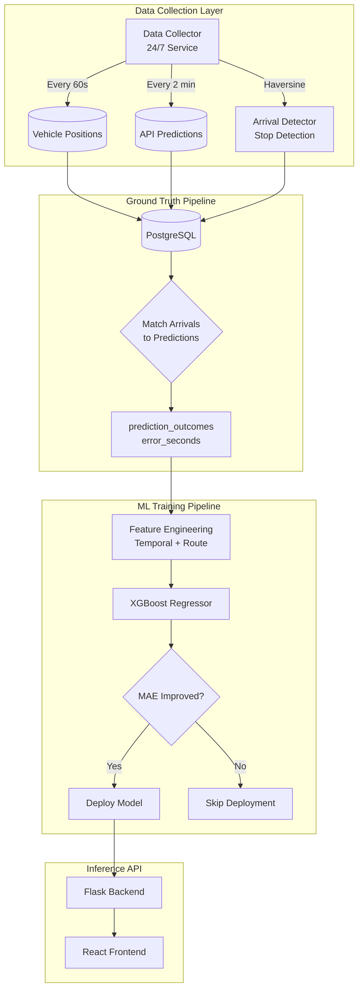

# Madison Metro ML

> **Real-time bus ETA prediction system** that corrects Madison Metro API predictions using machine learning. Reduces arrival time prediction errors through ground truth collection and autonomous model retraining.

[](https://python.org)
[](https://xgboost.readthedocs.io/)
[](https://postgresql.org)
[](https://railway.app)

---

## 🎯 The Problem

The Madison Metro API provides real-time bus positions and predicted arrival times. However, these predictions have inherent errors—sometimes off by several minutes. This project builds an ML system that learns from historical patterns to **predict how wrong the API's predictions will be**, enabling corrected ETAs for users.

```
API says: "Bus arrives in 5 min"
ML model: "Actually, expect ~7 min (historically 2 min late on this route at rush hour)"
```

---

## 🏗️ System Architecture



---

## 🔬 Technical Highlights

### Ground Truth Collection

Most transit ML projects fail because they predict the API's own delay flag (circular logic). This project solves that by:

1. **Detecting actual arrivals** using GPS positions + stop coordinates (Haversine distance < 30m)
2. **Matching predictions to arrivals** to compute real error
3. **Storing ground truth** for supervised learning

```python
# The target variable we actually care about:
error_seconds = actual_arrival_time - api_predicted_arrival_time
# Positive = late, Negative = early
```

### Autonomous Retraining

The model improves continuously without manual intervention:

- **Nightly GitHub Action** at 3 AM CST
- Fetches last 7 days of prediction outcomes
- Trains XGBoost regressor
- **Only deploys if MAE improves** (prevents regression)
- Full audit trail in `ml_training_runs` table

### Feature Engineering

| Category | Features | Rationale |
|----------|----------|-----------|
| Temporal | `hour`, `day_of_week`, `is_rush_hour` | Delays vary by time of day |
| Route | `route_avg_error`, `route_frequency` | Some routes are systematically late |
| Historical | `hr_route_error` | Hour+route specific patterns |

---

## 📊 Data Pipeline

**10,000 API calls/day** optimized for maximum data collection:

| Endpoint | Interval | Daily Calls | Purpose |
|----------|----------|-------------|---------|
| `getvehicles` | 60s | ~4,300 | Live bus positions |
| `getpredictions` | 120s | ~2,900 | API arrival predictions |
| **Total** | | **~7,200** | Leaves headroom under 10k limit |

**Database Tables:**

| Table | Records | Purpose |
|-------|---------|---------|
| `vehicle_observations` | Growing | Raw GPS data |
| `predictions` | Growing | API predictions at collection time |
| `stop_arrivals` | Growing | Detected bus arrivals at stops |
| `prediction_outcomes` | Growing | **Ground truth** (matched predictions → arrivals) |
| `ml_training_runs` | Per training | Model version history + metrics |

---

## 🚀 Quick Start

### Local Development

```bash
# 1. Clone and install
git clone https://github.com/matteso1/madison-bus-eta.git
cd madison-bus-eta

# 2. Backend (requires Python 3.11+)
cd backend
pip install -r requirements.txt
python -m flask run --port=5000

# 3. Frontend (requires Node 18+)
cd frontend
npm install
npm run dev
```

Open **<http://localhost:5173>** → Live map with 60+ buses

### Environment Variables

```bash
# Required
MADISON_METRO_API_KEY=your_api_key
DATABASE_URL=postgresql://...

# Optional (for streaming)
SENTINEL_ENABLED=true
SENTINEL_HOST=sentinel.railway.internal
```

---

## 📁 Project Structure

```
madison-bus-eta/
├── backend/                 # Flask API + ML inference
│   ├── app.py              # Main API routes
│   └── utils/              # API helpers
├── frontend/               # React + Vite + TypeScript
│   ├── src/components/     # Map, RouteList, etc.
│   └── src/hooks/          # Custom React hooks
├── collector/              # 24/7 Data Collection Service
│   ├── collector.py        # Main collection loop
│   ├── arrival_detector.py # Stop detection (Haversine)
│   └── db.py               # SQLAlchemy models
├── ml/                     # Machine Learning Pipeline
│   ├── features/           # Feature engineering
│   │   └── regression_features.py
│   ├── training/           # Training scripts
│   │   └── train_regression.py
│   └── models/             # Model registry + saved models
└── .github/workflows/      # CI/CD
    └── nightly-training.yml
```

---

## 🔌 API Reference

| Endpoint | Description |
|----------|-------------|
| `GET /health` | System status + uptime |
| `GET /routes` | All 29 Madison Metro routes |
| `GET /vehicles` | Live bus positions (60+ buses) |
| `GET /vehicles?rt=80` | Filter by route |
| `GET /patterns?rt=A` | Route geometry (polylines) |
| `GET /predictions?stpid=1234` | Arrival predictions for stop |
| `GET /ml/status` | Current model version + metrics |
| `POST /predict-arrival` | Get corrected ETA prediction |

---

## 🛠️ Technologies

| Layer | Technology |
|-------|------------|
| **Frontend** | React 18, TypeScript, Vite, Leaflet |
| **Backend** | Flask, Python 3.11 |
| **ML** | XGBoost, scikit-learn, pandas, NumPy |
| **Database** | PostgreSQL (Railway) |
| **Streaming** | [Sentinel](https://github.com/matteso1/sentinel) (custom message queue) |
| **Infra** | Railway (API + Collector + DB), GitHub Actions |

---

## 📈 Metrics & Monitoring

The system tracks:

- **MAE (Mean Absolute Error)** - Primary metric, measures avg prediction error in seconds
- **RMSE** - Penalizes large errors more heavily
- **Improvement vs Baseline** - How much better than just trusting the API

All training runs are logged to PostgreSQL for full auditability.

---

## 🔮 Future Improvements

- [ ] Real-time model inference on live predictions
- [ ] User accounts with saved routes
- [ ] Push notifications for significant delays
- [ ] Weather data integration (rain → more delays)
- [ ] Grafana dashboard for monitoring

---

## 📄 License

MIT License - See [LICENSE](LICENSE) for details.

---

<p align="center">
  Built by <a href="https://github.com/matteso1">@matteso1</a> as a portfolio project demonstrating end-to-end ML system design.
</p>
