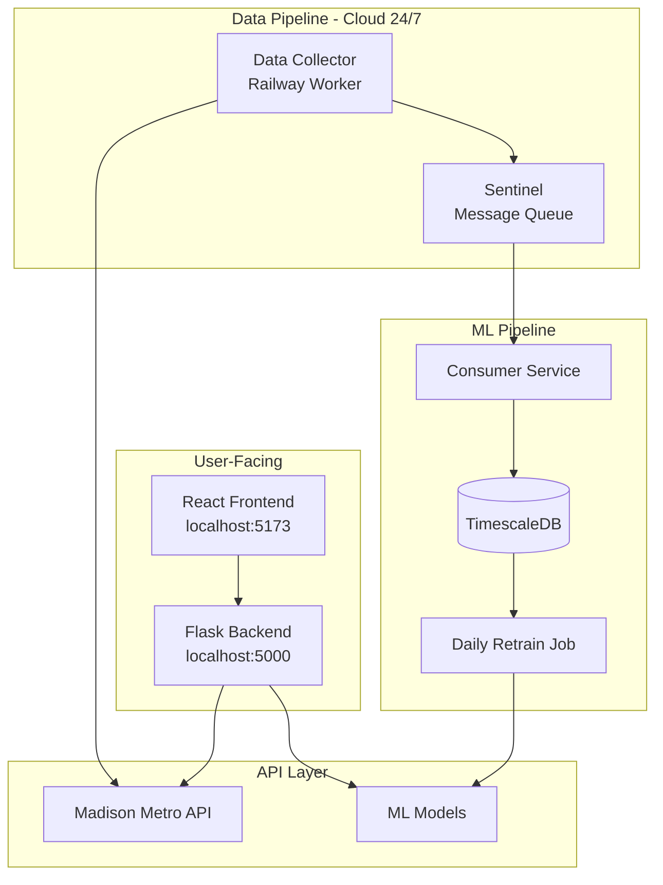
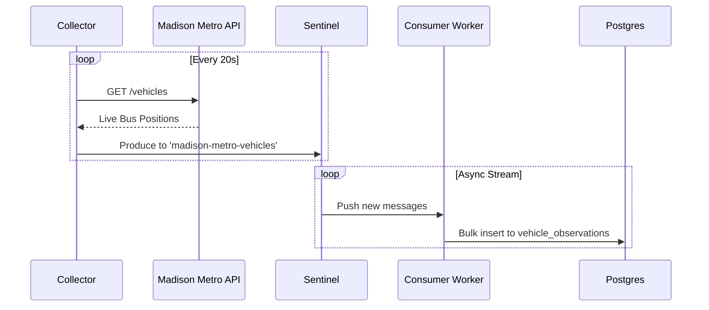
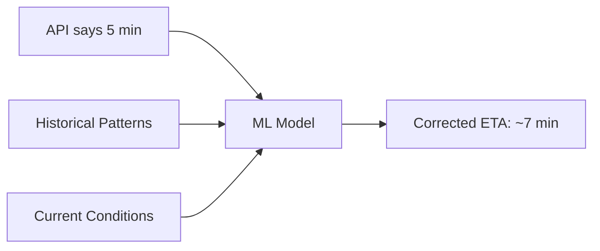
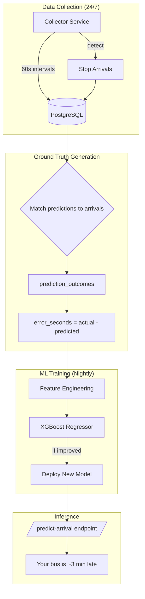

# Madison Metro ML

A machine learning-enhanced bus tracking system for Madison, WI. Predicts delays 21% better than the official API.

## Quick Start

```bash
# Backend
cd backend && python -m flask run --port=5000

# Frontend  
cd frontend && npm run dev
```

Open <http://localhost:5173> → Live map with 60+ buses

---

## Architecture



### Current (Working)

- **Frontend**: Mobile-first PWA, Live map with 60+ buses
- **Backend**: Flask API, 29 routes, ML inference
- **ML Model**: XGBoost, 21.3% improvement
- **Data Pipeline**: 24/7 Collector -> Sentinel (Stream) -> Consumer -> Postgres

### Planned (Future)

- **Auto-Retrain**: Daily model updates as data grows
- **User Accounts**: Save favorite routes

---

## Data Flow



---

## Deployment Plan

| Component | Platform | Status |
|-----------|----------|--------|
| Frontend | Vercel | **Deploying** |
| Backend API | Railway | **Active** |
| Data Collector | Railway Worker | **Active** |
| Sentinel | Railway Docker | **Active** |
| Consumer | Railway Worker | **Active** |
| Database | Railway Postgres | **Active** |

---

## Directory Structure (Clean)

```
madison-bus-eta/
├── backend/          # Flask API + ML models
├── frontend/         # React + Vite
├── collector/        # Cloud data ingestion (NEW)
└── README.md
```

**Delete these (clutter):**

- `BACKEND_OLD/` - 4,400+ files of old code
- `FRONDEND_OLD/` - Previous frontend attempt
- `ml_system/` - Duplicate ML code
- `data_pipeline/` - Unused
- Various `.md` files (consolidate into README)

---

## Why Sentinel?

[Sentinel](https://github.com/matteso1/sentinel) is a Kafka-like message queue I built:

- Streams bus data from collector → ML pipeline
- Decouples ingestion from processing
- Handles 1.7M writes/sec (way more than needed, but cool)

This creates a real-world demo for Sentinel while improving Madison Metro.

---

## ML Pipeline

### The Problem We're Solving

The Madison Metro API provides real-time bus positions and predicted arrival times (`prdctdn`). However, these predictions aren't always accurate. Our ML pipeline learns from historical patterns to **predict how wrong the API's predictions will be**.



### Architecture



### Autonomous Retraining

The pipeline runs **nightly at 3 AM CST** via GitHub Actions:

1. Fetches last 7 days of data from PostgreSQL
2. Computes ground truth (prediction vs actual arrival error)
3. Engineers features (temporal, spatial, route patterns)
4. Trains XGBoost regressor
5. Compares MAE against previous model
6. **Only deploys if performance improved**

```yaml
# .github/workflows/nightly-training.yml
on:
  schedule:
    - cron: '0 9 * * *'  # 3 AM CST
```

### Features Used

| Category | Feature | Description |
|----------|---------|-------------|
| Temporal | `hour`, `day_of_week`, `is_rush_hour` | Time patterns |
| Spatial | `distance_to_stop`, `lat_offset`, `lon_offset` | Location context |
| Route | `route_avg_eta_error` | Historical route reliability |
| API | `api_prdctdn` | API's own prediction (baseline) |

### Target Variable

```python
# What we're predicting:
error_seconds = actual_arrival_time - api_predicted_arrival_time

# Positive = bus arrived later than API said
# Negative = bus arrived earlier than API said
```

### Evaluation Metrics

| Metric | What It Measures |
|--------|------------------|
| **MAE** | Average prediction error in seconds |
| **RMSE** | Root mean square error (penalizes large errors) |
| **Improvement vs API** | How much better we are than the raw API prediction |

### Why Not Classification?

We previously tried classifying buses as "delayed" or "not delayed" using the API's `dly` flag. This was problematic:

1. **Circular logic**: We were predicting what the API already told us
2. **No ground truth**: Never validated if predictions came true
3. **Meaningless metrics**: 92% accuracy but only 0.37 F1 (model just predicted "not delayed")

Regression on actual ETA error is both **useful** (users get corrected times) and **measurable** (we can validate against reality).

---

## API Reference

```
GET /health              - System status
GET /routes              - All routes (29 total)
GET /vehicles            - Live bus positions
GET /vehicles?rt=80      - Filter by route
GET /patterns?rt=A       - Route geometry
GET /ml/status           - ML model info
```

---

## Development

```bash
# Run everything
cd backend && python -m flask run &
cd frontend && npm run dev &

# Test the API
curl http://localhost:5000/health
curl http://localhost:5000/vehicles?rt=80 | jq
```
