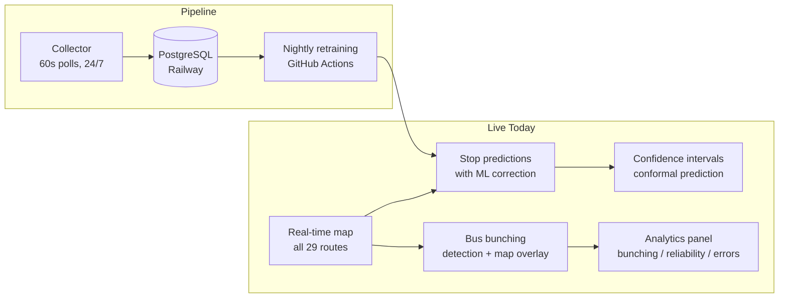
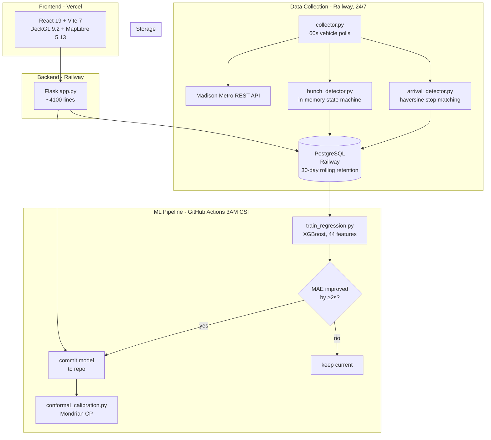
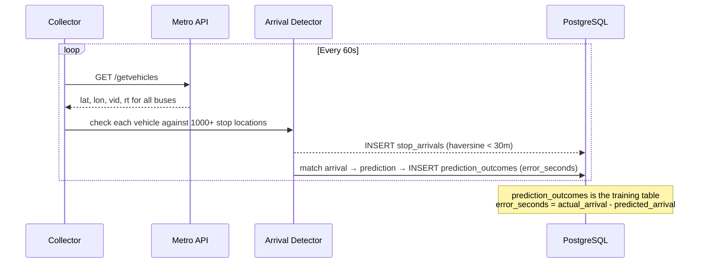
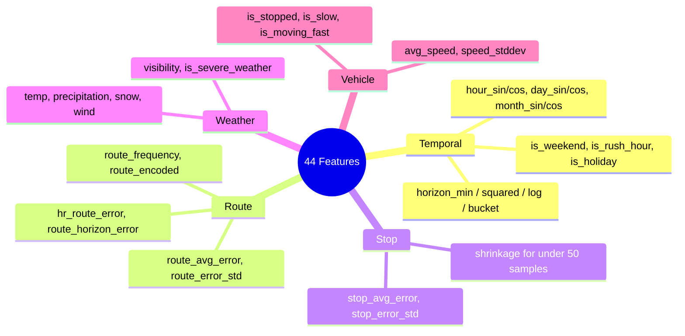
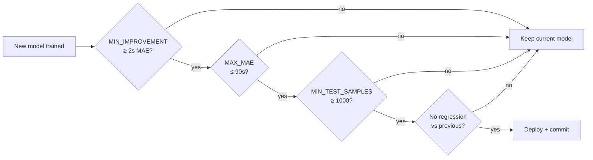
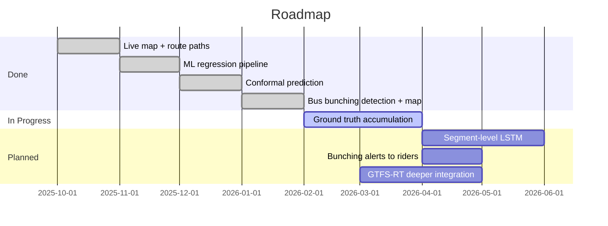

# Madison Metro ETA

A real-time bus tracking, ML prediction, and transit analytics system for Madison, WI. Built because the official Metro app is genuinely bad and in 2025 there's no excuse for it.

**Live:** [madison-bus-eta.vercel.app](https://madison-bus-eta.vercel.app)
**GitHub:** [github.com/matteso1/madison-bus-eta](https://github.com/matteso1/madison-bus-eta)

> **Heads up:** The Madison Metro API has a cap of ~10,000 requests/day. If this gets a lot of traffic simultaneously, live bus data may degrade. Working on it.

---

## What's Actually Built Right Now



### The Map
Dark-mode, DeckGL-accelerated map (MapLibre + deck.gl). Click any stop to see arrival predictions. Select a route to see its path and live vehicle positions. The map renders ~60 simultaneous bus markers without breaking a sweat. Compare this to the official Metro app.

### ML Predictions
The API tells you a bus arrives in 8 minutes. This system learns when that estimate is off — by how much, in which direction, for which routes at which times. An XGBoost regression model trained on `error_seconds` (actual minus predicted) corrects the API estimate. Uncertainty bounds come from Mondrian conformal prediction, stratified by route × day-type × horizon bucket — meaning the 90% confidence interval is statistically guaranteed to contain the actual arrival 90% of the time. No other transit app does this.

> **Current status:** The ML model is only as good as the ground truth data accumulated so far. The pipeline is running and collecting — the model improves every night. The interesting part right now is the architecture, not the numbers.

### Bus Bunching Detection
Two buses on the same route within 500m for 2+ consecutive 60s polls = confirmed bunching event. The map highlights the road segment between them in amber, snapped to the actual route polyline (not a GPS diagonal). Looks like Google Maps traffic. The Analytics > Bunching tab shows frequency by route over 7 days. This is a feature no transit app currently surfaces to riders.

### Analytics Panel
- **Performance** — MAE trend, model coverage, training history
- **Errors** — prediction error by horizon, hour-of-day bias
- **Routes** — reliability scores per route
- **Bunching** — bunching events by route, recent feed

---

## Architecture



---

## Ground Truth Pipeline

This is the core of the ML system. The API gives predictions — we measure how wrong they are.



---

## ML Feature Vector

44 features. Order matters for the model.



---

## Deployment Gates

The nightly pipeline won't deploy a model that isn't better:



---

## What's Next

This is a research project and the roadmap is ambitious.



**Segment-level travel time decomposition** — decompose each route into stop-to-stop segments, learn a travel time distribution per segment conditioned on time/weather/headway. Sum segments for the full prediction. Inspired by recent work on Montreal's STM network (LSTM outperforming transformers by 18-52% at 275x fewer parameters). This is the approach most likely to actually beat the API.

**Bunching alerts** — "Route B is bunching near East Campus right now, next bus may be delayed." No transit app does this. The detection is already running — surfacing it as a user-facing alert is the next step.

**Calibrated confidence as the differentiator** — the conformal prediction layer already gives statistically guaranteed intervals. Once enough ground truth accumulates to properly validate coverage, this becomes a publishable result.

---

## Stack

| Layer | Tech |
|-------|------|
| Frontend | React 19, TypeScript, Vite 7, Tailwind 4, DeckGL 9.2, MapLibre 5.13, Recharts |
| Backend | Flask, SQLAlchemy, Python 3.11 |
| ML | XGBoost, scikit-learn, Mondrian conformal prediction |
| Database | PostgreSQL (Railway, 30-day retention) |
| Infra | Railway (backend + collector + DB), Vercel (frontend), GitHub Actions (nightly training) |

---

## Local Dev

```bash
# Backend
cd backend
pip install -r requirements.txt
cp .env.example .env   # add MADISON_METRO_API_KEY
flask run --port=5000

# Frontend
cd frontend
npm install
npm run dev            # http://localhost:5173
```

The frontend works read-only without an API key. Live vehicles and ML predictions require `MADISON_METRO_API_KEY`.

---

## Contributing / Feedback

This is an active research project. If you're a Madison student or dev and want to poke at it, break it, or contribute — open an issue or email [nilsmatteson@icloud.com](mailto:nilsmatteson@icloud.com).

If you hit the API rate limit or see something wrong, please report it. Real usage data is genuinely useful for the research.

---

MIT License
