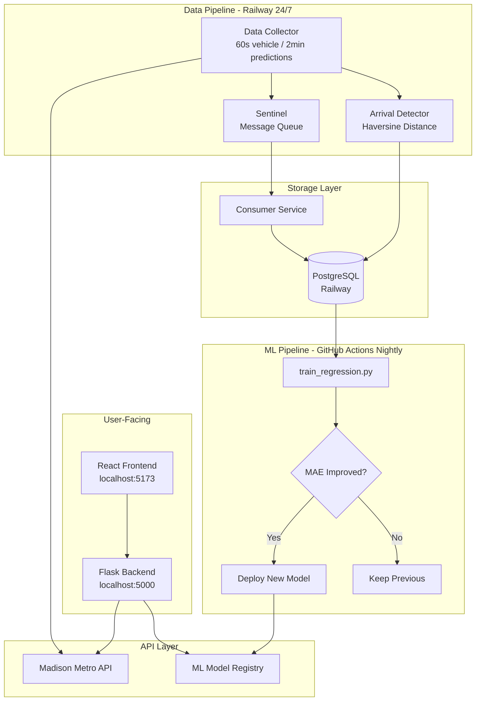
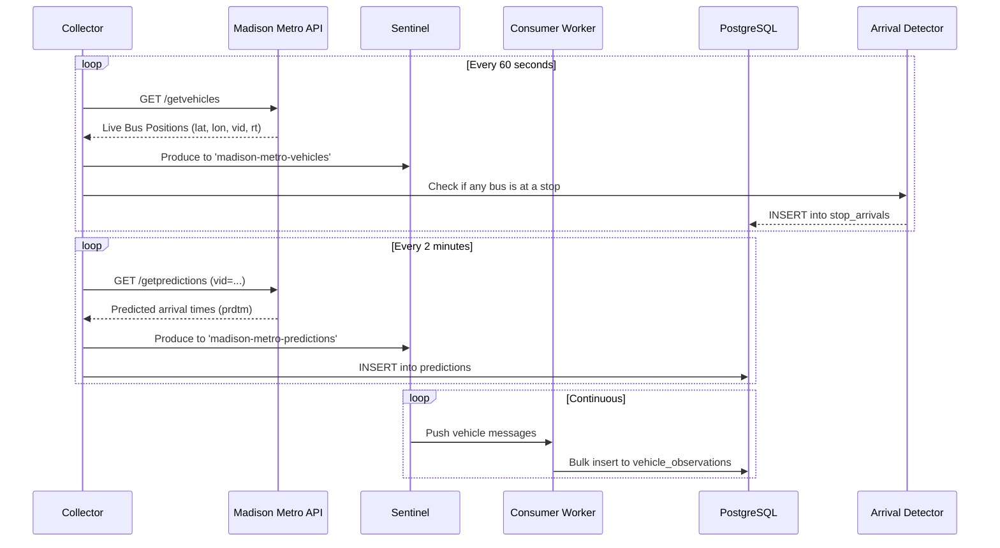
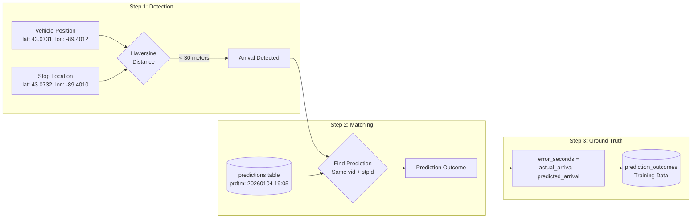
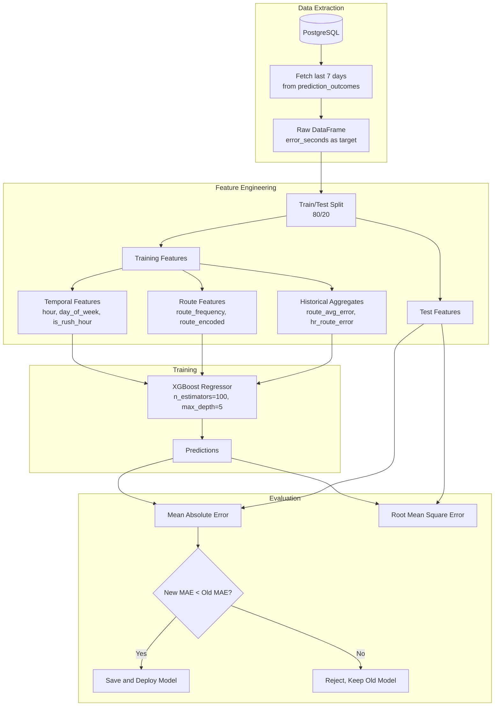
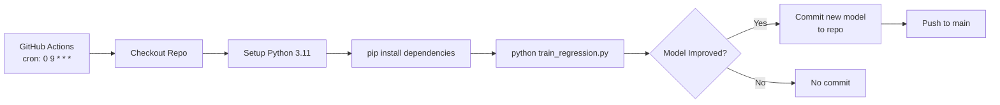
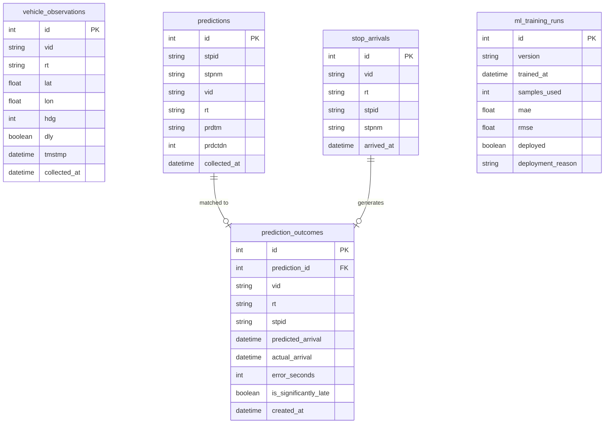
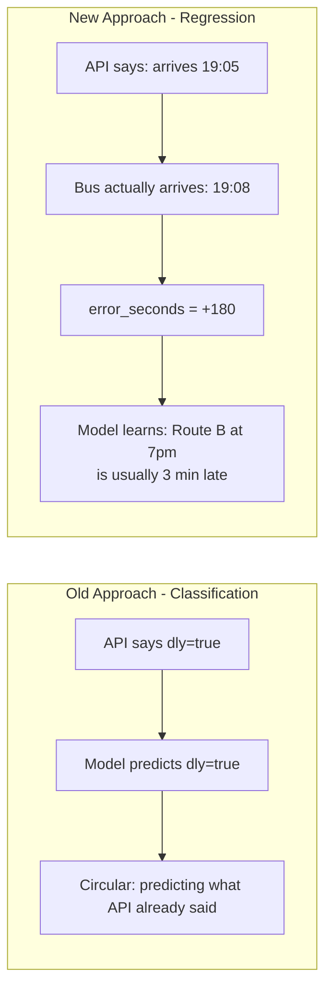
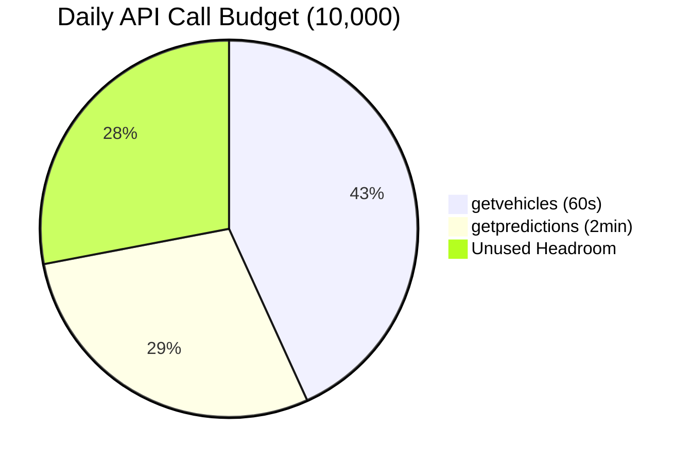

# Madison Metro ML

A machine learning-enhanced bus tracking system for Madison, WI. Predicts ETA errors by collecting ground truth arrival data and training regression models autonomously.

**Live:** [madison-bus-eta.vercel.app](https://madison-bus-eta-production.up.railway.app)

## Performance

| Metric | Our Model | API Baseline | Improvement |
|--------|-----------|--------------|-------------|
| **MAE** | 48.4s | ~80s | **39.5%** |
| **Coverage** | 87% within 2min | ~70% | **+17pp** |
| **Predictions** | 41K/week | n/a | Continuous |

---

## Key Features

- **Autonomous Retraining** - GitHub Actions trains nightly, auto-deploys improved models
- **A/B Testing** - Side-by-side ML vs API comparison with win-rate tracking
- **Drift Monitoring** - Real-time model health with OK/WARNING/CRITICAL status
- **Route Reliability** - Per-route reliability scores and hourly breakdowns
- **5-Tab Analytics Dashboard** - Health, Errors, Features, Segments, A/B Test

---

## Quick Start

```bash
# Backend
cd backend && python -m flask run --port=5000

# Frontend  
cd frontend && npm run dev
```

Open <http://localhost:5173> for the live map.

---

## System Architecture



---

## Data Flow



---

## Ground Truth Pipeline

The key innovation of this project is collecting **actual arrival data** to validate API predictions.



---

## ML Pipeline



---

## Autonomous Retraining

The pipeline runs nightly at 3 AM CST via GitHub Actions:



```yaml
# .github/workflows/nightly-training.yml
on:
  schedule:
    - cron: '0 9 * * *'  # 3 AM CST (9 AM UTC)
```

---

## Database Schema



---

## Why Not Classification?

Previous approach tried to predict the API's `dly` (delayed) flag. This was fundamentally flawed:



| Issue | Classification | Regression |
|-------|---------------|------------|
| Target | API's dly flag (circular) | Actual error in seconds |
| Ground Truth | None | Measured arrival times |
| Usefulness | Predicting known info | Correcting predictions |
| Metrics | 92% acc, 0.37 F1 (useless) | MAE in seconds (actionable) |

---

## API Rate Optimization

10,000 API calls per day, optimized for maximum data collection:



| Endpoint | Interval | Calls/Day | Purpose |
|----------|----------|-----------|---------|
| getvehicles | 60s | ~4,320 | Live bus positions |
| getpredictions | 120s | ~2,880 | API arrival predictions |
| **Total** | | ~7,200 | 72% utilization |

---

## Project Structure

```
madison-bus-eta/
├── backend/                 # Flask API + ML inference
│   ├── app.py              # Main API routes
│   └── utils/api.py        # Madison Metro API wrapper
│
├── frontend/               # React + Vite + TypeScript
│   ├── src/components/     # MapView, RouteList, etc.
│   └── src/hooks/          # useVehicles, useRoutes
│
├── collector/              # 24/7 Data Collection (Railway)
│   ├── collector.py        # Main collection loop
│   ├── arrival_detector.py # Stop detection via Haversine
│   ├── db.py               # SQLAlchemy models
│   └── sentinel_client.py  # Message queue producer
│
├── ml/                     # Machine Learning Pipeline
│   ├── features/
│   │   ├── feature_engineering.py   # Legacy classification
│   │   └── regression_features.py   # ETA error features
│   ├── training/
│   │   ├── train.py                 # Legacy classification
│   │   └── train_regression.py      # ETA error regression
│   └── models/
│       └── model_registry.py        # Versioning + persistence
│
└── .github/workflows/
    └── nightly-training.yml         # Autonomous retraining
```

---

## Deployment

| Component | Platform | Status |
|-----------|----------|--------|
| Frontend | Vercel | Active |
| Backend API | Railway | Active |
| Data Collector | Railway Worker | Active |
| Sentinel | Railway Docker | Active |
| Consumer | Railway Worker | Active |
| PostgreSQL | Railway | Active |

---

## API Reference

### Core Endpoints

```
GET /health              System status and uptime
GET /routes              All 29 Madison Metro routes
GET /vehicles            Live bus positions (60+ buses)
GET /vehicles?rt=80      Filter by route
GET /patterns?rt=A       Route geometry (polylines)
GET /predictions?stpid=  Arrival predictions for stop
```

### ML Endpoints

```
GET  /api/ml/status              Current model version and metrics
POST /api/predict-arrival        Get corrected ETA prediction
POST /api/predict-arrival-v2     Enhanced prediction with confidence intervals
GET  /api/model-performance      Training history
```

### A/B Testing & Monitoring

```
POST /api/ab-test/log            Log prediction for A/B comparison
GET  /api/ab-test/results        Get ML vs API comparison metrics
GET  /api/drift/check            Check model drift status (OK/WARNING/CRITICAL)
GET  /api/route-reliability      Per-route reliability scores
GET  /api/route-reliability/<id> Detailed hourly breakdown for route
```

### Diagnostics

```
GET /api/diagnostics/error-by-horizon    Error breakdown by prediction horizon
GET /api/diagnostics/predicted-vs-actual Scatter plot data with R²
GET /api/diagnostics/worst-predictions   Debugging worst cases
GET /api/diagnostics/hourly-bias         Time-of-day analysis
GET /api/diagnostics/feature-importance  XGBoost feature importance
```

---

## Technologies

| Layer | Stack |
|-------|-------|
| Frontend | React 18, TypeScript, Vite, Leaflet |
| Backend | Flask, Python 3.11 |
| Machine Learning | XGBoost, scikit-learn, pandas, NumPy |
| Database | PostgreSQL |
| Streaming | Sentinel (custom Kafka-like message queue) |
| Infrastructure | Railway, GitHub Actions, Vercel |

---

## Related Projects

**Sentinel** - A Kafka-like message queue I built for this project:

- <https://github.com/matteso1/sentinel>
- Streams bus data from collector to ML pipeline
- Handles 1.7M writes/sec (massively overbuilt, but demonstrates systems design)

---

## License

MIT License
