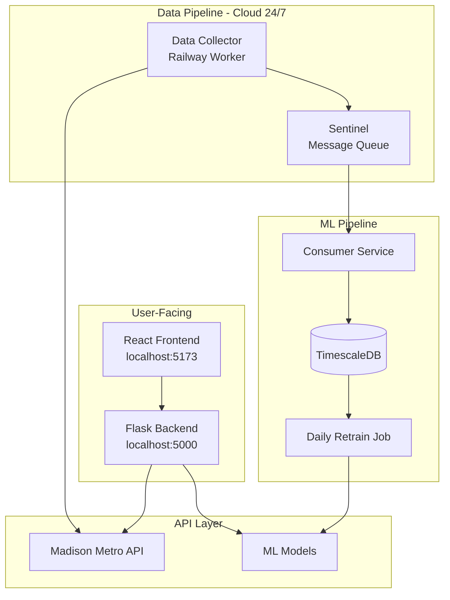
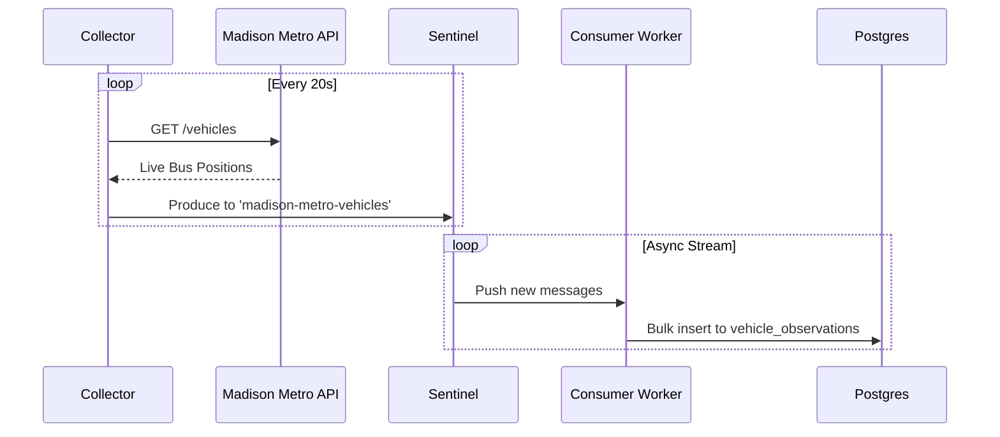

# Madison Metro ML

A machine learning-enhanced bus tracking system for Madison, WI. Predicts delays 21% better than the official API.

## Quick Start

```bash
# Backend
cd backend && python -m flask run --port=5000

# Frontend  
cd frontend && npm run dev
```

Open <http://localhost:5173> → Live map with 60+ buses

---

## Architecture



### Current (Working)

- **Frontend**: Mobile-first PWA, Live map with 60+ buses
- **Backend**: Flask API, 29 routes, ML inference
- **ML Model**: XGBoost, 21.3% improvement
- **Data Pipeline**: 24/7 Collector -> Sentinel (Stream) -> Consumer -> Postgres

### Planned (Future)

- **Auto-Retrain**: Daily model updates as data grows
- **User Accounts**: Save favorite routes

---

## Data Flow



---

## Deployment Plan

| Component | Platform | Status |
|-----------|----------|--------|
| Frontend | Vercel | **Deploying** |
| Backend API | Railway | **Active** |
| Data Collector | Railway Worker | **Active** |
| Sentinel | Railway Docker | **Active** |
| Consumer | Railway Worker | **Active** |
| Database | Railway Postgres | **Active** |

---

## Directory Structure (Clean)

```
madison-bus-eta/
├── backend/          # Flask API + ML models
├── frontend/         # React + Vite
├── collector/        # Cloud data ingestion (NEW)
└── README.md
```

**Delete these (clutter):**

- `BACKEND_OLD/` - 4,400+ files of old code
- `FRONDEND_OLD/` - Previous frontend attempt
- `ml_system/` - Duplicate ML code
- `data_pipeline/` - Unused
- Various `.md` files (consolidate into README)

---

## Why Sentinel?

[Sentinel](https://github.com/matteso1/sentinel) is a Kafka-like message queue I built:

- Streams bus data from collector → ML pipeline
- Decouples ingestion from processing
- Handles 1.7M writes/sec (way more than needed, but cool)

This creates a real-world demo for Sentinel while improving Madison Metro.

---

## ML Model

**Current Approach:**

- XGBoost regression
- 204K training records → Overfit
- Needs more diverse data

**Roadmap:**

1. Collect 6+ months of data (24/7 cloud collector)
2. Proper train/val/test splits by time
3. Feature engineering: weather, events, historical patterns
4. Possibly LSTM for sequence modeling

---

## API Reference

```
GET /health              - System status
GET /routes              - All routes (29 total)
GET /vehicles            - Live bus positions
GET /vehicles?rt=80      - Filter by route
GET /patterns?rt=A       - Route geometry
GET /ml/status           - ML model info
```

---

## Development

```bash
# Run everything
cd backend && python -m flask run &
cd frontend && npm run dev &

# Test the API
curl http://localhost:5000/health
curl http://localhost:5000/vehicles?rt=80 | jq
```
